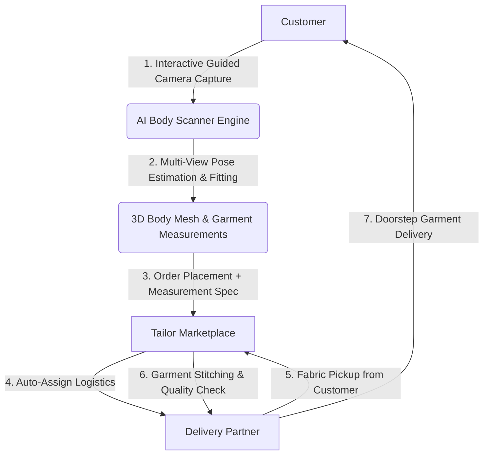
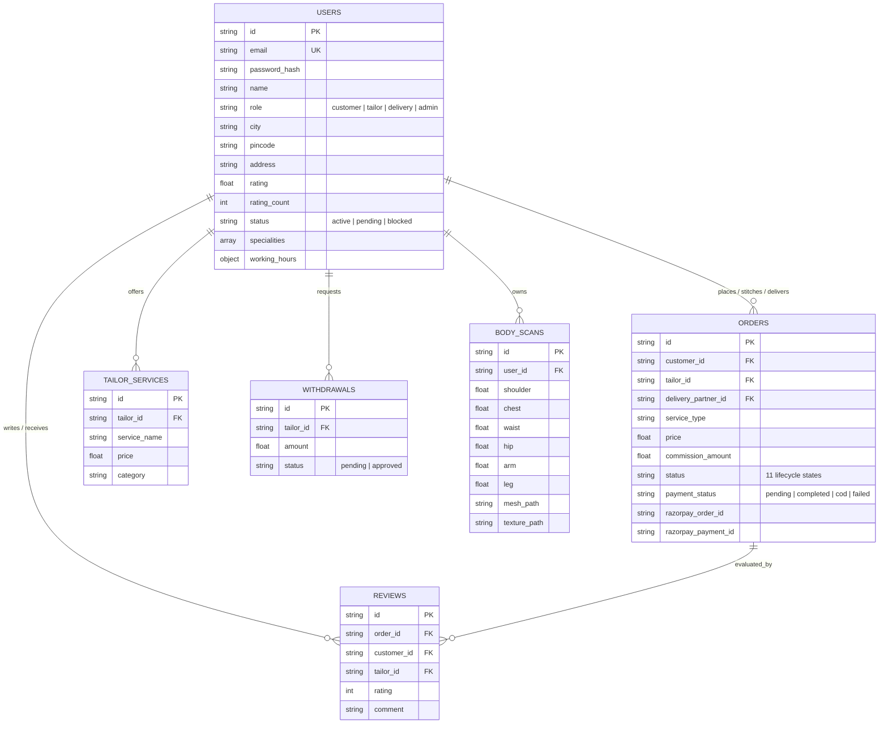

# Stitchly — AI-Powered Bespoke Tailoring Marketplace & Digital Measurement Engine

[]()
[]()
[]()
[]()
[](https://expo.dev/)
[](https://fastapi.tiangolo.com/)
[](https://www.mongodb.com/)
[](https://razorpay.com/)
[](LICENSE)

Stitchly is an end-to-end, multi-sided digital tailoring platform that bridges customers, local bespoke tailors, and delivery partners. By combining real-time computer vision pose estimation, parametric 3D body reconstruction, automated tailoring measurement extraction, and location-aware marketplace operations, Stitchly enables contactless, perfect-fit custom clothing from home.

---

## Overview

### What Stitchly Is
Stitchly is a production-ready mobile and backend platform designed to modernize the custom garment industry. It replaces physical measuring tapes with a smartphone-guided AI body scanner, connects customers with skilled local tailors based on location and specialty, orchestrates fabric pickup and finished garment delivery, and automates financial split settlements.

### Why It Was Built
Custom tailoring offers unmatched garment fit and personalization compared to mass-produced off-the-rack fashion. However, traditional custom tailoring suffers from geographical limitations, manual measurement errors, friction in scheduling fittings, and a lack of digital infrastructure for local tailors. Online custom clothing platforms often fail because self-reported customer measurements have high error rates (often ±5cm to ±10cm), resulting in expensive alterations, returns, and customer dissatisfaction. Stitchly was engineered to solve the "fit problem" at scale using AI body scanning while empowering local craftspeople with digital storefronts.

### Target Users
1. **Customers**: Individuals seeking custom-made or altered apparel (suits, blouses, lehengas, dresses, kurtas) who want precise measurements without visiting a physical store.
2. **Tailors & Boutiques**: Local garment artisans, boutique owners, and master tailors looking to digitize their storefronts, receive structured digital orders with exact garment measurements, manage earnings, and request payouts.
3. **Delivery Partners**: Logistics personnel who fulfill hyper-local door-to-door fabric pickups and finished garment deliveries with transparent earnings per job.
4. **Platform Administrators**: Operations managers who monitor revenue metrics, enforce quality standards, manage commission rates, approve tailor registrations, and process financial withdrawals.

### Core Idea
Convert standard multi-angle smartphone camera photos into accurate 3D anthropometric measurements and parametric body meshes, feeding structured design and measurement data into a hyper-local multi-role marketplace.

---

## Project Timeline

```text
2025 – 2026
│
├── MVP Development (Sachin)
│
├── Collaboration Begins
│
├── AI Workflow Integration
│
├── Delivery Automation
│
├── Google Maps Integration
│
├── Real-Time Tracking
│
├── Closed Testing
│
└── Future Public Release
```

---

## Problem Statement

### Problems in Traditional Tailoring
- **In-Person Measurement Friction**: Requires customers to travel to tailor shops for initial measurements and multiple fitting sessions.
- **Human Error & Inconsistency**: Manual tape measurements vary between different tailors and measuring styles, leading to fitting discrepancies.
- **Geographic Fragmentation**: Skilled artisans are often limited to local foot traffic, restricting their market reach and revenue potential.

### Problems with Online Tailoring
- **Self-Measurement Failure**: Customers lack tailoring knowledge and typically fail to accurately measure key dimensions like chest volume, shoulder slope, sleeve pitch, or inseam.
- **High Return & Alteration Rates**: E-commerce custom tailors experience high return rates due to ill-fitting clothing caused by inaccurate customer inputs.
- **Lack of Visual Communication**: Customers struggle to communicate design modifications, reference images, and fabric notes to tailors remotely.

### Why Existing Solutions Are Insufficient
Generic e-commerce platforms do not accommodate the complex workflows of custom stitching (fabric pickup, progressive stitching states, double-leg delivery, custom commission structures). Standard 3D scanning solutions often require specialized hardware (LiDAR, depth sensors) or expensive cloud GPU infrastructure, making them inaccessible for everyday consumers and small business tailors. Stitchly operates on standard RGB mobile cameras with intelligent hybrid compute (edge smoothing + server processing).

---

## Solution

Stitchly provides a seamless end-to-end platform connecting all stakeholders through a single unified architecture.



### Complete End-to-End Workflow
1. **Customer Discovery & Scan**: Customer opens the app, discovers nearby tailors filtered by city or pincode, and performs an AI-assisted 3-view body scan (front, side, back).
2. **Measurement Synthesis**: The AI engine computes 9 key tailoring measurements (shoulder width, chest circumference, waist circumference, hip circumference, arm length, leg length, inseam, neck, thigh) and constructs a textured 3D mesh.
3. **Order Placement**: Customer selects a garment service, uploads reference pictures/descriptions, chooses Cash-on-Delivery or online payment via Razorpay, and attaches their measurement profile.
4. **Tailor Acceptance & Logistics**: The tailor receives the order spec, accepts it, and the system automatically routes a delivery partner based on geographic proximity.
5. **Fabric & Delivery Execution**: The delivery partner picks up raw fabric from the customer, delivers it to the tailor, updates progress states (`picked_up` $\rightarrow$ `delivered_to_tailor` $\rightarrow$ `in_stitching` $\rightarrow$ `completed` $\rightarrow$ `out_for_delivery`), and delivers the finished garment back to the customer.
6. **Settlement**: Upon delivery confirmation, the platform automatically processes commission splits and credits the tailor's withdrawal-ready earnings balance.

---

## Screenshots

| Customer Marketplace & Discovery | AI Body Scanner Interface |
|:---:|:---:|
|  |  |

| Tailor Order Management | Delivery Partner & Map Tracking |
|:---:|:---:|
|  |  |

| Order Lifecycle Status | Admin Governance & Analytics |
|:---:|:---:|
|  |  |

---

## Key Features

### Customer
- **Tailor Directory & Filtering**: Search and filter nearby tailors by specialty (Blouse, Lehenga, Men's Suit, Kurta, Sherwani, Alterations), rating, minimum price, city, or pincode.
- **Interactive Tailor Profiles**: View tailor portfolios, working hours, customer reviews, overall ratings, and service catalog with itemized pricing.
- **AI Body Scanner**: Step-by-step camera interface to record body measurements and view estimated garment metrics.
- **Custom Order Placement**: Select tailoring services, specify design instructions, upload inspiration photos, select pickup/delivery addresses, and pick payment options.
- **Live Order Lifecycle Tracking**: Track orders real-time across 11 detailed statuses (`placed`, `accepted`, `pickup_assigned`, `picked_up`, `delivered_to_tailor`, `in_stitching`, `completed`, `ready`, `collected_from_tailor`, `out_for_delivery`, `delivered`).
- **Rating & Review System**: Rate tailors (1 to 5 stars) and post detailed feedback upon completed delivery.
- **Profile Management**: Update contact info, saved addresses, city/pincode location context, and body profile metrics (height, weight, body type).

### Tailor
- **Business Dashboard**: Overview of key business metrics: active orders, pending requests, total earnings, and average rating.
- **Order Management**: Review incoming order specs, inspect customer measurements/design notes, and accept or reject requests.
- **Progress Tracking**: Progressively update stitching status (`in_stitching` $\rightarrow$ `completed` $\rightarrow$ `ready`).
- **Service Catalog Management**: Add, update, or remove service offerings with specific prices and categories.
- **Working Hours Configurator**: Set weekly operational schedules (Monday through Sunday opening and closing hours).
- **Financial Earnings & Withdrawals**: View net earnings breakdown (gross order value minus platform commission), track pending versus available balances, and request payout withdrawals.

### Delivery Partner
- **Active Delivery Hub**: Real-time list of assigned jobs in the partner's operating city.
- **Status Lifecycle Control**: One-tap status transitions (`picked_up` $\rightarrow$ `delivered_to_tailor` $\rightarrow$ `collected_from_tailor` $\rightarrow$ `out_for_delivery` $\rightarrow$ `delivered`).
- **Google Maps Live Tracking**: Interactive map interface featuring real-time delivery pointer visualization and nearest-driver radius allocation.
- **Earnings Tracker**: Monitor delivery income calculated at a fixed fee (₹50 per fulfilled delivery).

### Order Management
- **11-State Machine**: Robust status transition handling preventing invalid state movements.
- **Automatic Logistics Assignment**: City-matched delivery partner selection upon tailor order acceptance within a 5 km service radius.
- **Multi-Address Support**: Separate pickup and delivery address strings for customer convenience.

### Delivery
- **Two-Phase Logistics**: Phase 1 handles customer-to-tailor fabric transfer; Phase 2 handles tailor-to-customer final garment delivery.
- **Location-Based Matching**: Matches pickup requests with delivery drivers active in the same city/pincode region.

### Authentication
- **Role-Based Token Auth**: Secure JSON Web Tokens (JWT) using `HS256` encryption with embedded user identity and role scopes (`customer`, `tailor`, `delivery`, `admin`).
- **Password Security**: Irreversible `bcrypt` password hashing via Python `passlib`.
- **Account Protection**: Instant token validation and account block checks on every protected route.

### Profile
- **Role-Specific Fields**: Custom schema fields for customers (height, weight, body shape), tailors (experience, specialties, shop hours), and delivery partners (vehicle/city context).
- **Location Auto-Computation**: Automatically formats readable location strings from city and pincode entries.

---

## AI Measurement Workflow

The Stitchly AI measurement pipeline transforms 2D camera frames into validated 3D anthropometric tailoring data.

```
       +--------------------+
       | User Height Input  |
       +---------+----------+
                 |
                 v
     +-----------------------+      +-----------------------+
     | Real-Time Position    | ---> | Guided Capture        |
     | Analysis & Feedback   |      | (Front / Side / Back) |
     +-----------------------+      +-----------+-----------+
                                                |
                                                v
     +-----------------------+      +-----------------------+
     | Landmark Confidence   | <--- | MediaPipe Pose        |
     | Filtering (vis > 0.5) |      | (33 3D Landmarks)     |
     +-----------+-----------+      +-----------------------+
                 |
                 v
     +-----------------------+      +-----------------------+
     | Multi-Frame Buffer    | ---> | Multi-View Fusion     |
     | Smoothing (EMA)       |      | & Ramanujan Ellipse   |
     +-----------------------+      +-----------+-----------+
                                                |
                                                v
     +-----------------------+      +-----------------------+
     | 3D Parametric Mesh /  | <--- | Tailoring Measurement |
     | Texture Map Generator |      | Validation & Scaling  |
     +-----------------------+      +-----------------------+
```

### Detailed Pipeline Stages

#### 1. Guided Scanning & Real-Time Position Analysis
Before initiating measurement capture, the client streams frames to `/api/ai/check-position`. The backend evaluates body placement using key shoulder and hip landmarks:
- **Horizontal Centering**: Calculates `body_center = (left_shoulder.x + right_shoulder.x) / 2`. Returns `"Move Left"` if $> 0.6$ or `"Move Right"` if $< 0.4$.
- **Distance Calibration**: Checks shoulder pixel width against expected scale. Returns `"Move Closer"` if shoulder width $< 35\text{cm}$ proxy or `"Move Back"` if $> 60\text{cm}$ proxy.
- **Posture Alignment**: Calculates vertical shoulder tilt `abs(left_shoulder.y - right_shoulder.y)`. Returns `"Stand Straight"` if tilt $> 0.05$.
- Output: Returns `"Perfect Position"` once all alignment thresholds pass.

#### 2. Multi-Angle View Capture (Front / Side / Back)
The mobile app guides the user through capturing three distinct static photographs:
1. **Frontal View**: Captures shoulder width, chest width, waist width, hip width, arm length, and overall vertical height.
2. **Side View**: Captures torso depth, chest depth, waist depth, and posture pitch.
3. **Back View**: Validates posterior shoulder span and upper back curvature.

#### 3. Pose Estimation & Landmark Detection
Each captured frame is processed by MediaPipe Pose (`model_complexity=2`). The model outputs 33 standardized 3D body landmarks $(x, y, z)$ with individual visibility scores:
- **Key Landmarks Utilized**: Nose (0), Shoulders (11, 12), Elbows (13, 14), Wrists (15, 16), Hips (23, 24), Knees (25, 26), Ankles (27, 28).

#### 4. Landmark Confidence Filtering & Multi-Frame Smoothing
- **Visibility Thresholding**: Landmarks with a visibility score below $0.5$ are clamped to `NaN` values to prevent unreliable keypoints from corrupting downstream calculations.
- **Sliding-Window Frame Buffering**: Captured frame keypoints are held in a ring buffer (`maxlen=5` to `10` frames).
- **Exponential Moving Average (EMA)**: Performs temporal landmark averaging across buffered frames while ignoring `NaN` values, filtering out high-frequency camera shake and hand jitter.

#### 5. Height-Based Pixel Scaling Factor
User-provided height ($H_{\text{cm}}$) establishes the absolute real-world scale:
$$\text{Pixel Height} = \text{EuclideanDistance2D}(\mathbf{p}_{\text{nose}}, \mathbf{p}_{\text{ankle}})$$
$$\text{Scale Factor } S = \frac{H_{\text{cm}}}{\text{Pixel Height}}$$
All 2D and 3D pixel distance calculations are multiplied by $S$ to yield real-world metric dimensions in centimeters.

#### 6. Multi-View Fusion & Ramanujan Ellipse Circumference Reconstruction
Cross-sectional body measurements (chest, waist, hip circumferences) cannot be directly measured from single 2D frontal views. Stitchly uses a multi-view fusion algorithm combined with Ramanujan's formula for ellipse circumferences:
- **Width Extraction ($a$)**: Fuses frontal and back views:
  $$\text{Width}_{\text{shoulder}} = \text{Mean}(W_{\text{front\_shoulder}}, W_{\text{back\_shoulder}}) \times S$$
  $$\text{Width}_{\text{hip}} = \text{Mean}(W_{\text{front\_hip}}, W_{\text{back\_hip}}) \times S$$
- **Depth Extraction ($b$)**: Extracted from side-view shoulder-to-hip offset proxy scaled by $S$.
- **Ramanujan Ellipse Approximation**:
  Given semi-major axis $a = \frac{\text{Width}}{2}$ and semi-minor axis $b = \frac{\text{Depth}}{2}$:
  $$h = \frac{(a - b)^2}{(a + b)^2 + 10^{-6}}$$
  $$\text{Circumference} = \pi (a + b) \left[ 1 + \frac{3h}{10 + \sqrt{4 - 3h + 10^{-6}}} \right]$$

#### 7. Garment Measurement Generation & Boundary Validation
Limb lengths and circumferences are calculated using 3D Euclidean segment sums:
- **Arm Length**: $\text{Dist}(\mathbf{p}_{\text{shoulder}}, \mathbf{p}_{\text{elbow}}) + \text{Dist}(\mathbf{p}_{\text{elbow}}, \mathbf{p}_{\text{wrist}})$
- **Leg Length**: $\text{Dist}(\mathbf{p}_{\text{hip}}, \mathbf{p}_{\text{knee}}) + \text{Dist}(\mathbf{p}_{\text{knee}}, \mathbf{p}_{\text{ankle}})$
- **Inseam**: $\text{Dist}(\mathbf{p}_{\text{hip}}, \mathbf{p}_{\text{ankle}}) \times 0.86$
- **Neck & Thigh Proxies**: Derived from proportional chest and hip circumferences.
- **Physical Boundary Clipping**: All measurements are validated against physiological bounds (e.g., chest clamped between 70cm and 150cm) to guarantee valid tailoring specifications.

#### 8. Parametric 3D Mesh & Texture Map Generation
- **Parametric SMPL-X Reconstruction**: When model binaries are available, anthropometric measurements are mapped into a 10D shape parameter vector ($\boldsymbol{\beta}$) fed into PyTorch SMPL-X mesh generation:
  $$\beta_0 = \frac{\text{chest} - 95.0}{30.0}, \quad \beta_1 = \frac{\text{waist} - 82.0}{28.0}, \quad \beta_2 = \frac{\text{hip} - 98.0}{30.0}, \quad \beta_4 = \frac{H_{\text{cm}} - 170.0}{20.0}$$
- **Procedural Ellipsoid Mesh Fallback**: For CPU-only servers without SMPL-X binaries, Trimesh constructs a calibrated 4-subdivision icosphere scaled along X, Y, Z radii matching shoulder width, height, and waist depth, aligned to ground level ($y=0$).
- **HSV Skin Tone Texture Extraction**: Extracts skin pixel masks using OpenCV HSV color range thresholding (`H: 0–35`, `S: 20–220`, `V: 40–255`), computes the mean BGR skin color, and exports a flat $1024 \times 1024$ PNG texture map.

---

## System Workflow

```
Customer                    Mobile App / API                FastAPI Backend                  Database / AI Engine
   |                               |                               |                                  |
   |--- 1. Open App & Auth ------->|                               |                                  |
   |    (Register / Login)         |--- 2. POST /auth/login ------>|                                  |
   |                               |<-- Return JWT & User Object --|                                  |
   |                               |                               |                                  |
   |--- 3. Launch AI Scanner ----->|                               |                                  |
   |    (Front, Side, Back Photos) |--- 4. POST /ai/scan-body ---->|                                  |
   |                               |                               |--- MediaPipe Pose Extraction --->|
   |                               |                               |--- Ramanujan Ellipse Fitting --->|
   |                               |                               |--- 3D Mesh & Texture Export ---->|
   |                               |<-- 5. Return 9 Measurements --|                                  |
   |                               |    & 3D Mesh / Texture Paths  |                                  |
   |                               |                               |                                  |
   |--- 6. Select Tailor Service ->|                               |                                  |
   |    & Place Order              |--- 7. POST /orders ---------->|                                  |
   |                               |                               |--- Save Order (status=placed) -->|
   |                               |                               |                                  |
   |--- 8. Online Payment (Razorpay)|-- 9. POST /payment/create-order->                               |
   |    (WebView Checkout)         |<-- Return Razorpay Order ID --|                                  |
   |--- 10. Complete Payment ----->|--- 11. POST /payment/verify ->|                                  |
   |                               |<-- Payment Verified Token ----|--- Update status=accepted ------>|
   |                               |                               |                                  |
   |                               |                               |=== Auto-Assign Delivery Partner==|
   |                               |                               |                                  |
   |                               |<-- Delivery Partner Alert ----|                                  |
   |                               |    (Status: picked_up -> delivered_to_tailor)                     |
   |                               |                               |                                  |
   |                               |<-- Tailor Stitching State ----|                                  |
   |                               |    (Status: in_stitching -> completed -> ready)                   |
   |                               |                               |                                  |
   |                               |<-- Final Delivery ------------|                                  |
   |                               |    (Status: out_for_delivery -> delivered)                       |
   |                               |                               |                                  |
   |--- 12. Submit Tailor Review -->|--- 13. POST /reviews -------->|                                  |
   |                               |                               |--- Update Tailor Rating -------->|
```

---

## Architecture

Stitchly follows a modern decoupled architecture separating presentation layer, API logic, background computer vision algorithms, and persistence mechanisms.

```mermaid
graph TB
    subgraph Mobile Client (Expo / React Native)
        UI[Expo Router UI Layer]
        Cam[Vision Camera Module]
        Map[Google Maps SDK Module]
        WV[Razorpay WebView]
        Storage[AsyncStorage Local Auth]
    end

    subgraph Backend Infrastructure (FastAPI Engine)
        Router[API Gateway / Routers]
        AuthModule[JWT & Bcrypt Security]
        OrderEngine[Order Lifecycle Manager]
        PayModule[Razorpay HMAC Payment Service]
    end

    subgraph AI Computer Vision Core
        MP[MediaPipe Pose Estimator]
        Smooth[Sliding Buffer & EMA]
        Calc[Ramanujan Measurement Engine]
        Mesh[SMPL-X / Trimesh 3D Generator]
    end

    subgraph Persistence Layer
        Mongo[(MongoDB Motor Async)]
        Disk[(Local Staging / Output Filesystem)]
    end

    UI -->|HTTP / REST| Router
    Cam -->|Image Streams| Router
    Map -->|Geospatial Queries| Router
    WV -->|PostMessage Events| UI
    Storage --> UI

    Router --> AuthModule
    Router --> OrderEngine
    Router --> PayModule
    Router --> AI Computer Vision Core

    AI Computer Vision Core --> MP
    MP --> Smooth
    Smooth --> Calc
    Calc --> Mesh
    Mesh --> Disk

    OrderEngine --> Mongo
    PayModule --> Mongo
    AuthModule --> Mongo
```

### Component Details

- **Frontend Application**: Built with Expo Router (React Native) providing native mobile rendering on Android and iOS alongside web fallback support.
- **Backend Framework**: Python FastAPI serving asynchronous non-blocking REST API endpoints powered by Uvicorn.
- **Database Layer**: MongoDB accessed asynchronously using the `Motor` driver, featuring collection indexes on user tokens, geospatial/city criteria, and order IDs.
- **AI / Computer Vision Core**: Python package (`pose_detector.py`, `measurement_calculator.py`, `body_reconstruction.py`) wrapping MediaPipe, PyTorch, NumPy, OpenCV, and Trimesh.
- **Storage Strategy**: Structured database storage for JSON documents, combined with local disk staging (`temp/`, `outputs/`) for source images, `.obj` 3D body models, and `.png` body texture maps.
- **Authentication**: Stateless bearer tokens holding signed claims with 24-hour expiration.
- **Payment Infrastructure**: Integration with Razorpay API (Test/Production Mode) using server-side HMAC-SHA256 signature verification and client-side WebView bridge communication.

---

## Tech Stack

### Mobile & Frontend
- **Framework**: Expo SDK 54 (React Native 0.81.5)
- **Routing & Navigation**: Expo Router v6 (`expo-router`), React Navigation (`@react-navigation/native`, `@react-navigation/bottom-tabs`)
- **Language**: TypeScript 5.9
- **Maps & Tracking**: Google Maps API, `react-native-maps`
- **Camera & Computer Vision**: `react-native-vision-camera` v4, `expo-camera`, `vision-camera-resize-plugin`, `react-native-worklets-core`
- **State & Local Storage**: `@react-native-async-storage/async-storage`, React Context API
- **Webview & UI Components**: `react-native-webview`, `react-native-reanimated`, `expo-blur`, `@expo/vector-icons`
- **Typography**: `@expo-google-fonts/playfair-display`, `@expo-google-fonts/manrope`

### Backend Server
- **Framework**: FastAPI (Python 3.10+)
- **Server Engine**: Uvicorn / Starlette
- **Async Mongo Client**: Motor v3.x (AsyncIOMotorClient)
- **Security & Auth**: PyJWT (`python-jose`), `passlib` with `bcrypt`
- **Payment SDK**: Razorpay Python SDK (`razorpay`)

### AI, Computer Vision & 3D Engine
- **Pose Detection**: Google MediaPipe Pose (`mediapipe`)
- **Image Processing**: OpenCV (`opencv-python`), NumPy
- **3D Modeling & Mesh**: PyTorch, Trimesh, SMPL-X (`smplx` optional GPU extension)

### Database & Storage
- **Database**: MongoDB 6.0+
- **File System**: Server-side local file staging for `.jpg`, `.png` textures, and `.obj` meshes

### Tools & Testing
- **Test Framework**: PyTest (`pytest`), HTTPX async client testing
- **API Testing Suite**: Automated test modules for marketplace flows, location queries, and Razorpay signature validation

---

## Folder Structure

```
Stitchly1/
├── memory/
│   └── PRD.md                       # Product Requirements Document & API reference
├── test_reports/
│   ├── iteration_1.json             # Core API test results
│   ├── iteration_2.json             # Location & city filtering test results
│   ├── iteration_3.json             # Razorpay payment verification test results
│   └── pytest/                      # XML test execution logs
├── backend/
│   ├── server.py                    # Main FastAPI application & routes
│   ├── pose_detector.py             # MediaPipe pose wrapper & EMA smoothing
│   ├── measurement_calculator.py    # Ramanujan ellipse & measurement engine
│   ├── body_reconstruction.py       # SMPL-X & Trimesh 3D reconstruction fallback
│   ├── requirements.txt             # Python backend dependencies
│   ├── .env                         # Server environment configuration
│   ├── ai/                          # Submodules for 3D body reconstruction
│   │   ├── body3d/
│   │   │   ├── body_reconstruction.py
│   │   │   ├── measurement_extractor.py
│   │   │   └── mesh_generator.py
│   │   ├── measurement_calculator.py
│   │   └── pose_detector.py
│   ├── outputs/                     # Generated 3D .obj meshes and texture maps
│   ├── temp/                        # Staged camera uploads
│   └── tests/                       # PyTest integration suites
│       ├── test_stitchly_api.py     # Core marketplace test suite (21 tests)
│       ├── test_location_features.py# Location & delivery filtering suite (9 tests)
│       └── test_razorpay_payments.py# Payment & HMAC verification suite (7 tests)
└── frontend/
    ├── package.json                 # React Native & Expo dependencies
    ├── app.json                     # Expo configuration
    ├── eas.json                     # Expo Application Services build config
    ├── tsconfig.json                # TypeScript compiler config
    ├── app/                         # Expo Router application screens
    │   ├── _layout.tsx              # Root app layout & theme provider
    │   ├── index.tsx                # Initial entry route / redirector
    │   ├── scan-body.tsx            # Camera scanner interface & AI trigger
    │   ├── checkout.tsx             # Razorpay WebView payment screen
    │   ├── +html.tsx                # Web document wrapper
    │   ├── (auth)/                  # Auth route group
    │   │   ├── login.tsx            # Login screen
    │   │   ├── register.tsx         # Role-based registration screen
    │   │   └── _layout.tsx          # Auth stack navigation
    │   ├── (customer)/              # Customer role screens
    │   │   ├── edit-profile.tsx     # Customer profile editor
    │   │   └── (tabs)/              # Customer bottom navigation
    │   │       ├── index.tsx        # Tailor marketplace directory & search
    │   │       ├── orders.tsx       # Customer order tracking list
    │   │       ├── profile.tsx      # Customer profile screen
    │   │       └── _layout.tsx      # Customer tab bar
    │   ├── (tailor)/                # Tailor role screens
    │   │   ├── edit-profile.tsx     # Tailor profile editor
    │   │   └── (tabs)/              # Tailor bottom navigation
    │   │       ├── index.tsx        # Tailor dashboard & order actions
    │   │       ├── orders.tsx       # Tailor order list management
    │   │       ├── earnings.tsx     # Tailor financial earnings & withdrawals
    │   │       ├── profile.tsx      # Tailor business profile & working hours
    │   │       └── _layout.tsx      # Tailor tab bar
    │   ├── (delivery)/              # Delivery partner role screens
    │   │   ├── edit-profile.tsx     # Delivery profile editor
    │   │   └── (tabs)/              # Delivery bottom navigation
    │   │       ├── index.tsx        # Delivery assignments & status updater
    │   │       ├── earnings.tsx     # Delivery earnings log
    │   │       ├── profile.tsx      # Delivery partner profile
    │   │       └── _layout.tsx      # Delivery tab bar
    │   ├── (admin)/                 # Admin governance screens
    │   │   ├── index.tsx            # Admin system analytics dashboard
    │   │   ├── orders.tsx           # Global order monitoring
    │   │   ├── settings.tsx         # Commission percentage configuration
    │   │   ├── users.tsx            # User list & tailor approval controls
    │   │   └── _layout.tsx          # Admin stack navigation
    │   ├── tailor/[id].tsx          # Tailor public profile & service list
    │   ├── place-order/[tailorId].tsx # Garment order creation screen
    │   ├── order/[id].tsx           # Detailed order view & Pay Now trigger
    │   └── review/[orderId].tsx     # Post-delivery tailor review submission
    └── src/
        ├── components/              # Shared UI components (LoadingScreen)
        ├── context/                 # Global state (AuthContext)
        └── utils/                   # Utilities (api.ts fetch client, theme.ts)
```

---

## Database Design

Stitchly uses MongoDB as its primary persistence engine, organized into 7 primary document collections with compound indexes for performant querying.



### Collection Schemas & Relationships

1. **`users` Collection**:
   - Stores account records for all 4 roles.
   - Tailor-specific fields: `specialities`, `experience`, `working_hours`, `rating`, `rating_count`.
   - Customer-specific fields: `height`, `weight`, `gender`, `bodyType`.
   - Indexes: `id` (unique), `email` (unique), `city`, `pincode`, compound `(role, city, status)`.

2. **`tailor_services` Collection**:
   - Stores individual tailoring items offered by tailors (e.g., "Blouse Stitching", "Lehenga", "Suit").
   - References `users.id` via `tailor_id`.
   - Indexes: `id` (unique), `tailor_id`.

3. **`orders` Collection**:
   - Central document managing transaction lifecycle and payment status.
   - Links `customer_id`, `tailor_id`, and `delivery_partner_id`.
   - Stores payment details: `price`, `commission_amount`, `payment_method`, `payment_status`, `razorpay_order_id`, `razorpay_payment_id`, `razorpay_signature`.
   - Indexes: `id` (unique), `customer_id`, `tailor_id`, `delivery_partner_id`.

4. **`reviews` Collection**:
   - Customer rating submissions for fulfilled orders.
   - References `order_id`, `customer_id`, and `tailor_id`.
   - Updates tailor aggregate `rating` and `rating_count` on creation.

5. **`withdrawals` Collection**:
   - Financial withdrawal requests created by tailors and approved by administrators.

6. **`body_scans` Collection**:
   - Stores output measurements, landmark metrics, `.obj` mesh file paths, and `.png` texture paths linked to `user_id`.

7. **`settings` Collection**:
   - Key-value platform configurations (e.g., `commission_percentage = 10.0`).

---

## APIs

Below is a document of key REST API endpoints implemented in `backend/server.py`.

### 1. User Authentication

#### `POST /api/auth/register`
- **Purpose**: Register a new customer, tailor, or delivery partner account.
- **Request Body**:
  ```json
  {
    "name": "Anita Desai",
    "email": "anita@test.com",
    "phone": "9800000001",
    "password": "customer123",
    "role": "customer",
    "city": "Mumbai",
    "pincode": "400001",
    "address": "123 Marine Drive",
    "height": "165",
    "weight": "58"
  }
  ```
- **Response** (`200 OK`):
  ```json
  {
    "token": "eyJhbGciOiJIUzI1NiIsIn...",
    "user": {
      "id": "u-uuid-1234",
      "name": "Anita Desai",
      "email": "anita@test.com",
      "role": "customer",
      "city": "Mumbai",
      "status": "active"
    }
  }
  ```

#### `POST /api/auth/login`
- **Purpose**: Authenticate user credentials and issue signed JWT.
- **Request Body**:
  ```json
  {
    "email": "ravi@stitchly.com",
    "password": "tailor123"
  }
  ```
- **Response** (`200 OK`): `token` and `user` object.

---

### 2. Tailor Marketplace

#### `GET /api/tailors`
- **Purpose**: Query active tailors with filters for specialty, city, pincode, max price, and rating.
- **Query Parameters**: `city=Mumbai`, `specialty=Blouse`, `min_rating=4.0`, `max_price=1500`
- **Response**: Array of tailor profiles including their attached `services`, `min_price`, and `max_price`.

---

### 3. AI Measurement & Camera Guidance

#### `POST /api/ai/check-position`
- **Purpose**: Real-time position guidance during camera scanning.
- **Form Data**: `image` (JPEG file), `height_cm` (float)
- **Response**:
  ```json
  {
    "success": true,
    "instruction": "Perfect Position",
    "landmarks": [{"x": 0.45, "y": 0.22, "z": -0.1}],
    "measurements": {"shoulder_width_cm": 42.5}
  }
  ```

#### `POST /api/ai/scan-body`
- **Purpose**: Process 3-view images (front, side, back) into 9 tailoring measurements and 3D textured mesh.
- **Form Data**: `front_image`, `side_image`, `back_image`, `height_cm`
- **Response**:
  ```json
  {
    "measurements": {
      "shoulder": 42.5,
      "chest": 94.2,
      "waist": 78.4,
      "hip": 98.1,
      "arm": 61.2,
      "leg": 102.5,
      "inseam": 79.0,
      "neck": 36.8,
      "thigh": 55.2
    },
    "mesh": "outputs/scan_123_body_mesh.obj",
    "texture": "outputs/scan_123_body_texture.png",
    "landmarks": [{"x": 0.42, "y": 0.18, "z": 0.05}]
  }
  ```

---

### 4. Order Management & Delivery

#### `POST /api/orders`
- **Purpose**: Customer creates a new tailoring order.
- **Auth**: Bearer Token (`customer`)
- **Request Body**:
  ```json
  {
    "tailor_id": "t-uuid-5678",
    "service_type": "Blouse Stitching",
    "description": "Red silk blouse with zari embroidery",
    "pickup_address": "123 Marine Drive, Mumbai",
    "payment_method": "online"
  }
  ```
- **Response**: Created order object with `status: "placed"`.

#### `PUT /api/orders/{id}/accept`
- **Purpose**: Tailor accepts order and system auto-assigns active city delivery driver.
- **Auth**: Bearer Token (`tailor`)

#### `PUT /api/delivery/{id}/update`
- **Purpose**: Delivery driver advances order logistics state.
- **Request Body**: `{"status": "delivered_to_tailor"}`

---

### 5. Razorpay Payments

#### `POST /api/payment/create-order`
- **Purpose**: Initialize a Razorpay payment order on the gateway.
- **Auth**: Bearer Token (`customer`)
- **Request Body**: `{"order_id": "ord-uuid-99"}`
- **Response**:
  ```json
  {
    "razorpay_order_id": "order_SFbb6aMqo1QgzO",
    "razorpay_key_id": "rzp_test_StitchlyKey",
    "amount": 80000,
    "currency": "INR"
  }
  ```

#### `POST /api/payment/verify`
- **Purpose**: Verify Razorpay payment signature using HMAC-SHA256.
- **Request Body**:
  ```json
  {
    "order_id": "ord-uuid-99",
    "razorpay_payment_id": "pay_SFbcXxYz123",
    "razorpay_order_id": "order_SFbb6aMqo1QgzO",
    "razorpay_signature": "e3b0c44298fc1c149afbf4c8996fb92427ae41e4649b934ca495991b7852b855"
  }
  ```
- **Response**:
  ```json
  {
    "verified": true,
    "amount": 800.0,
    "commission": 80.0,
    "tailor_earnings": 720.0
  }
  ```

#### `GET /api/payment/checkout/{order_id}`
- **Purpose**: Renders HTML page for WebView checkout embedding with `checkout.js`.

---

## Screens

Below is the catalog of mobile screens in `frontend/app/`.

### Public & Auth Screens
1. **Entry Route (`app/index.tsx`)**: Inspects auth token state and redirects to the appropriate role tab dashboard (`(customer)`, `(tailor)`, `(delivery)`, `(admin)`) or `(auth)/login`.
2. **Login Screen (`app/(auth)/login.tsx`)**: Email and password entry with role auto-detection and token persistence.
3. **Register Screen (`app/(auth)/register.tsx`)**: Role selection toggle (Customer / Tailor / Delivery), contact fields, and city/pincode selection.

### Customer Screens
4. **Marketplace Home (`app/(customer)/(tabs)/index.tsx`)**: Search header, specialty pill filters, rating selectors, city selector modal, and tailor card list with minimum pricing.
5. **Tailor Profile (`app/tailor/[id].tsx`)**: Detailed tailor profile displaying experience badge, rating, working hours, service catalog with prices, and customer reviews.
6. **AI Body Scanner (`app/scan-body.tsx`)**: Live camera view with bounding overlays, height input, multi-step capture (Front $\rightarrow$ Side $\rightarrow$ Back), scan processing indicator, and measurement output cards.
7. **Place Order (`app/place-order/[tailorId].tsx`)**: Service picker, instruction notes, reference picture attachment, address selector, payment method selection (Online / Cash on Delivery).
8. **Customer Orders (`app/(customer)/(tabs)/orders.tsx`)**: List of active and completed orders with status badges and quick navigation to order details.
9. **Order Details (`app/order/[id].tsx`)**: Complete order status timeline, tailor details, pickup/delivery addresses, "Pay Now" trigger button for unpaid online orders, and payment confirmation details.
10. **Razorpay Checkout WebView (`app/checkout.tsx`)**: Embedded WebView rendering server-side Razorpay HTML checkout with postMessage bridge handlers.
11. **Review Submission (`app/review/[orderId].tsx`)**: 5-star interactive rating component and comment text area.
12. **Customer Profile (`app/(customer)/(tabs)/profile.tsx`)**: Personal account information, body metric overview, saved addresses, and profile edit launcher (`edit-profile.tsx`).

### Tailor Screens
13. **Tailor Dashboard (`app/(tailor)/(tabs)/index.tsx`)**: Business stat cards (Active Orders, Revenue, Pending Requests, Average Rating) and incoming order action cards (Accept / Reject).
14. **Tailor Order Management (`app/(tailor)/(tabs)/orders.tsx`)**: Status transition controls allowing tailors to advance orders from `accepted` to `in_stitching`, `completed`, and `ready`.
15. **Tailor Earnings & Withdrawals (`app/(tailor)/(tabs)/earnings.tsx`)**: Gross earnings summary, platform commission deductions, available balance, withdrawal request modal, and payout history log.
16. **Tailor Profile & Store Settings (`app/(tailor)/(tabs)/profile.tsx`)**: Specialty tags configuration, working hours grid editor, and shop location updater.

### Delivery Partner Screens
17. **Delivery Assignment Hub (`app/(delivery)/(tabs)/index.tsx`)**: Assigned pickup and delivery jobs filtered by partner city, featuring one-tap status updates (`picked_up`, `delivered_to_tailor`, `out_for_delivery`, `delivered`).
18. **Delivery Earnings Log (`app/(delivery)/(tabs)/earnings.tsx`)**: Completed delivery log and total payout calculator (₹50 per delivery).

### Admin Screens
19. **Admin Analytics Dashboard (`app/(admin)/index.tsx`)**: High-level platform statistics: Total Revenue, Gross Platform Commission, Total Users count broken down by role, Delivered Orders metric, and Pending Tailor Approvals.
20. **User Governance (`app/(admin)/users.tsx`)**: Filterable table of all system accounts with buttons to approve pending tailors or toggle user block status.
21. **Settings & Commission Config (`app/(admin)/settings.tsx`)**: Platform setting form to modify global commission percentage (e.g., 10%).
22. **Global Order Monitor (`app/(admin)/orders.tsx`)**: System-wide view of all customer orders across all statuses.

---

## Challenges Faced

### 1. Camera Alignment & Human Distance Variability
- **Challenge**: Users held smartphones at arbitrary distances, tilts, and angles, causing inconsistent body proportions in photos.
- **Solution**: Developed real-time pre-capture bounding checks in `/api/ai/check-position`. The algorithm calculates relative shoulder width and posture tilt, providing instant visual feedback ("Move Closer", "Stand Straight") before allowing image capture.

### 2. High-Frequency Pose Detection Jitter
- **Challenge**: Single-frame MediaPipe landmark detection exhibited keypoint jitter, producing fluctuating measurement estimates.
- **Solution**: Implemented an Exponential Moving Average (EMA) smoother paired with a 5-to-10 frame sliding window buffer (`PoseDetector` in `pose_detector.py`). Low-confidence landmarks ($<0.5$ visibility) are filtered out, stabilizing measurement accuracy within target $\pm 2\text{cm}$ bounds.

### 3. Estimating 3D Body Circumferences from 2D Photographs
- **Challenge**: A single 2D frontal photo provides width but lacks depth, making direct volume calculation impossible.
- **Solution**: Designed a multi-view fusion algorithm combining frontal/back width measurements with side-view depth proxies, processed through Ramanujan's formula for ellipse circumferences.

### 4. Heterogeneous Compute Environments (GPU vs CPU Fallback)
- **Challenge**: High-end parametric 3D body fitting (SMPL-X) requires CUDA GPU resources and model weights, which are unavailable on standard CPU-only cloud instances.
- **Solution**: Built a dual-mode reconstruction architecture (`body_reconstruction.py`). If SMPL-X binaries and PyTorch GPU drivers are present, the system fits a 10D beta vector; otherwise, it seamlessly falls back to a calibrated procedural icosphere mesh generator.

### 5. Cross-Platform Native Mobile Payment Integration
- **Challenge**: Integrating native Razorpay SDKs into React Native Expo managed workflows often causes native build breaking changes or plugin conflicts.
- **Solution**: Created a server-rendered HTML checkout endpoint (`/api/payment/checkout/{order_id}`) hosted on the FastAPI backend. The mobile app renders this page inside `react-native-webview` and uses postMessage bridge events (`PAYMENT_SUCCESS`, `PAYMENT_CANCELLED`, `PAYMENT_FAILED`) to seamlessly handle transactions.

### 6. Location-Aware Multi-Side Marketplace Routing
- **Challenge**: Matching delivery drivers and tailors across different cities without expensive third-party GIS services.
- **Solution**: Engineered MongoDB regex and indexed city/pincode queries that dynamically filter tailors and automatically assign delivery partners active within the same city jurisdiction.

---

## Engineering Decisions

### 1. Expo Router (React Native) vs. Native Android/iOS
- **Decision**: Selected Expo Router (React Native) with TypeScript.
- **Rationale**: Allowed a single unified codebase to serve Android, iOS, and Web platforms. File-based routing structured complex multi-role navigation cleanly across Customer, Tailor, Delivery, and Admin tabs.

### 2. FastAPI Async Backend vs. Node.js Express
- **Decision**: Selected Python FastAPI over Node.js.
- **Rationale**: FastAPI seamlessly integrates with Python's scientific and computer vision ecosystem (MediaPipe, OpenCV, PyTorch, NumPy, Trimesh) while offering high-performance asynchronous IO with `asyncio` and `Motor`.

### 3. MongoDB Document Store vs. PostgreSQL Relational Database
- **Decision**: Selected MongoDB.
- **Rationale**: Tailoring orders and AI body scan measurements involve semi-structured data (variable 3D landmark arrays, optional reference photos, dynamic working hours dictionary). MongoDB's JSON document format accommodated schema flexibility while compound indexes maintained fast query performance.

### 4. Hybrid Compute Strategy (Edge Guidance + Server Reconstruction)
- **Decision**: Split computer vision processing between client-side frame capture and server-side model execution.
- **Rationale**: Heavy 3D mesh rendering and multi-view Ramanujan calculations execute on the backend, keeping the mobile application lightweight, responsive, and battery-efficient.

### 5. Server-Side HMAC Verification for Payments
- **Decision**: Mandatory server verification of Razorpay payment signatures (`razorpay_signature`).
- **Rationale**: Client-side payment confirmation can be spoofed. Requiring server-side HMAC-SHA256 signature verification guarantees that order status and tailor earnings are only updated upon cryptographic proof of payment.

---

## Collaboration

Stitchly was initiated by **Sachin Pandey**, who architected and built the original working MVP establishing the platform's core multi-role marketplace, authentication system, backend services, and payment integration.

To expand Stitchly beyond traditional marketplace boundaries, **Aditya** joined the project to co-lead the transformation into an AI-assisted digital tailoring ecosystem. Together, Sachin and Aditya collaboratively engineered the 3D computer vision scanning pipeline, automated delivery assignments, real-time tracking interfaces, and customer experience enhancements.

### Summary of Responsibilities

| Team Member | Primary Responsibilities |
|---|---|
| **Aditya** | AI platform evolution, delivery automation, logistics workflow, Google Maps integration, live tracking, customer experience improvements, UI redesign, backend integration, debugging, code quality |
| **Sachin Pandey** | Project initiation, MVP development, application architecture, authentication, payment integration, backend foundation, initial UI implementation, core platform development |

---

## Team Contributions

### Aditya

#### AI Platform Evolution
- Collaborated on expanding Stitchly from a traditional tailoring marketplace into an AI-assisted digital tailoring ecosystem.
- Contributed to the architectural planning and implementation of the AI-assisted tailoring workflow.
- Helped shape the future direction of the platform.

#### Logistics & Delivery
- Designed and implemented the automatic delivery assignment system.
- Implemented nearest-driver allocation using a configurable 5 km service radius.
- Developed the delivery assignment workflow and supporting backend logic.

#### Maps & Real-Time Tracking
- Integrated Google Maps APIs.
- Built the delivery map interface.
- Implemented live delivery tracking.
- Added real-time delivery pointer visualization.

#### Customer Experience & UI
- Redesigned customer-facing interfaces
- Improved navigation flow
- Refined layouts
- Standardized interface consistency
- Enhanced usability

#### Code Quality & Backend Support
- Identified and fixed missing backend API endpoints required for complete application workflows.
- Debugged frontend-backend integration issues.
- Refactored repeated and duplicated functions to improve maintainability.
- Integrated newly developed frontend modules with existing backend services.
- Improved overall code quality and project stability.

#### Engineering Collaboration
- Participated in architectural discussions, feature planning, testing, code reviews, and product refinement.

---

### Sachin Pandey

#### Project Foundation
- Initiated the Stitchly project.
- Designed the initial application architecture.
- Developed the first working MVP.
- Built the original customer, tailor, and delivery workflows.
- Established the core project structure.

#### Core Platform Development
- Implemented authentication.
- Implemented the payment system.
- Developed the initial backend services.
- Built the foundational application logic.
- Integrated the core business workflows.

#### Initial User Experience
- Designed and implemented the original application screens.
- Created the initial navigation flow.
- Built the first functional user experience.

#### AI Platform Evolution
- Collaborated on expanding the platform into an AI-assisted tailoring ecosystem.
- Participated in architectural planning and implementation of the AI-assisted tailoring workflow.
- Contributed to implementation discussions and testing.

#### Engineering Collaboration
- Participated in architectural discussions, feature planning, debugging, testing, code reviews, and collaborative development.

---

## Future Roadmap

- [ ] **Virtual Garment Try-On (VTON)**: Overlay 3D rendered garment models onto customer SMPL-X body meshes for virtual fitting visualization.
- [ ] **Real-Time Push Notifications**: Integrate Firebase Cloud Messaging (FCM) or Expo Push Notifications for immediate order status updates and pickup alerts.
- [ ] **AI Fabric Texture Recognition**: Computer vision fabric scanner to automatically detect material type (silk, cotton, linen) and recommend thread tension/stitching settings to tailors.
- [ ] **Coupons & Promotional Referral Engine**: Promotional discount codes, customer referral bonuses, and tailor marketing campaigns.
- [ ] **Direct Chat & Voice Notes**: In-app messaging between customer and tailor for instant clarification on design customizations.

---

## Deployment Status

### Closed Beta Testing
The Android application has been successfully deployed for internal closed testing.

Core customer, tailor, delivery, and AI workflows have been fully validated across test iterations.

Future public release will include production payment credentials and cloud infrastructure deployment.

- **Backend API Tests**: 21/21 core API tests passed (100%).
- **Location Feature Tests**: 9/9 location and city filtering tests passed (100%).
- **Payment Gateway Integration**: 7/7 Razorpay test mode payment verification tests passed (100%).
- **Known Limitations**:
  - Real-time 3D mesh rendering falls back to pre-rendered OBJ snapshots on devices with hardware GL restrictions.
  - Payment gateway operates on Razorpay Test Mode pending production merchant key activation.

---

## Lessons Learned

1. **AI Input Quality Dictates Output Accuracy**: Mobile camera measurements are highly sensitive to user posture. Implementing real-time position validation feedback (`/api/ai/check-position`) prior to image capture significantly improved measurement accuracy compared to raw image uploads.
2. **Graceful Fallbacks Are Essential for AI Systems**: Server hardware variability requires software elasticity. Designing a procedural icosphere mesh fallback ensured that server deployments without expensive GPUs could still run body scan APIs without throwing runtime exceptions.
3. **Decoupled Architecture Accelerates Multi-Role Apps**: Separating API logic into strict role-based endpoints and middleware (`require_customer`, `require_tailor`, `require_admin`) prevented role leakage and simplified frontend navigation state management.
4. **WebView Bridges Solve Cross-Platform Native Bottlenecks**: Offloading complex third-party SDK flows (like Razorpay payments) to server-rendered HTML pages with WebView messaging provided high reliability without modifying native app builds.

---

## Innovation Highlights

The architecture and technical implementation of Stitchly demonstrate a practical realization of an **AI-assisted digital tailoring and automated bespoke marketplace workflow**.

Specifically, the codebase implements:
1. **Multi-Angle Camera Guidance**: Guided acquisition of human body poses using standard RGB mobile sensors.
2. **Pose Landmark Extraction & Scaling**: Algorithmic conversion of 2D landmark coordinates into physical metric tailoring dimensions using user height scaling.
3. **Multi-View Ramanujan Ellipse Fitting**: Reconstruction of 3D cross-sectional circumferences from multi-angle planar photos.
4. **Automated Tailoring Spec Transmission**: Direct electronic transmission of verified digital measurement profiles to artisan order queues.

*Note: This technical documentation describes the functional software implementation and system architecture for demonstration, portfolio, and engineering evaluation purposes without asserting formal legal patent claims.*

---

## License

This project is licensed under the MIT License — see the [LICENSE](LICENSE) file for details.
